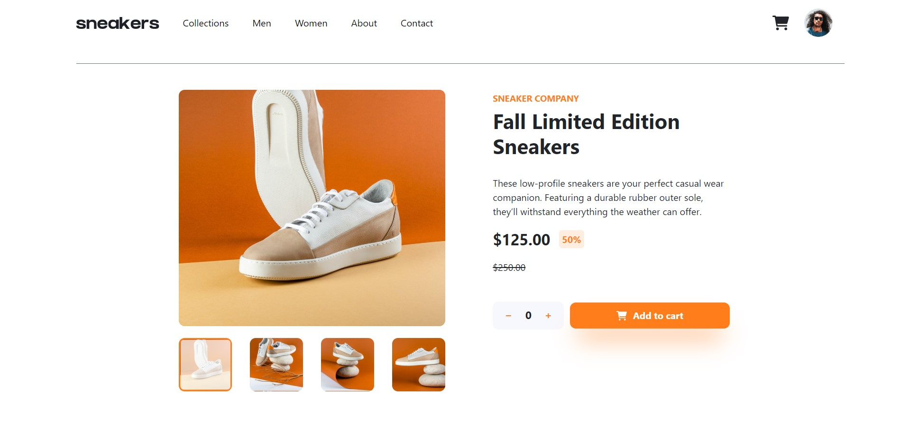
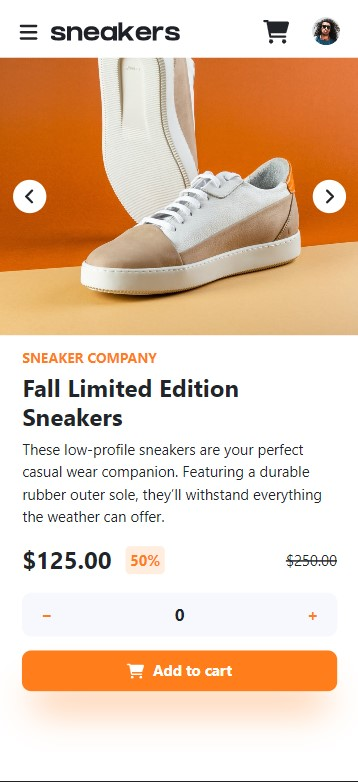

# Frontend Mentor - E-commerce product page solution

This is a solution to the [E-commerce product page challenge on Frontend Mentor](https://www.frontendmentor.io/challenges/ecommerce-product-page-UPsZ9MJp6). Frontend Mentor challenges help you improve your coding skills by building realistic projects.

## Table of contents

- [Overview](#overview)
  - [The challenge](#the-challenge)
  - [Screenshot](#screenshot)
  - [Links](#links)
- [My process](#my-process)
  - [Built with](#built-with)
  - [What I learned](#what-i-learned)
- [Author](#author)
- [Acknowledgments](#acknowledgments)

## Overview

### The challenge

Users should be able to:

- View the optimal layout for the site depending on their device's screen size
- See hover states for all interactive elements on the page
- Open a lightbox gallery by clicking on the large product image
- Switch the large product image by clicking on the small thumbnail images
- Add items to the cart
- View the cart and remove items from it

### Screenshot

### Links

- Solution URL: [GitHub Reop](https://github.com/8xMohab/ecommerce-product-page)
- Live Site URL: [GitHub Pages](https://8xmohab.github.io/)

## My process

Build components and its html (3.5 Hours)
Style the components (10 Hours)
Learn redux and create a store (2 Days)
Add states and functions to the components (6 Hours)
Commit changes and push to GitHub
Run first build and deploy to gh-pages

### Built with

- [React](https://reactjs.org/) - JS library
- [Redux](https://redux.js.org/) - JS library
- SASS
- Mobile-first workflows

### What I learned

 - Using Redux toolkit to manage the app states
 - Remove duplicate items from an array with arr.reduce()
 - Format Numbers (250 => $250.00) with Intl.NumberFormat in javascript

## Author

- Frontend Mentor - [@8xMohab](https://www.frontendmentor.io/profile/8xMohab)
- Twitter - [@8xMohab](https://www.twitter.com/8xMohab)

## Acknowledgments
  [All Things JavaScript, LLC](https://www.youtube.com/watch?v=5JFJTGZ4gHQ) - Helped me filter duplicate items in an array
